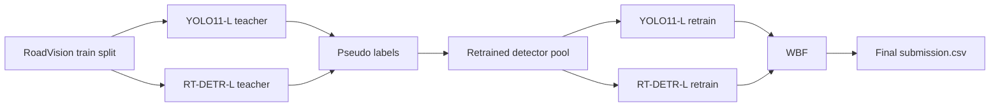

# Complex Hybrid Architecture

## Goal

Combine two detectors, refine them through pseudo labeling, and fuse their final predictions with Weighted Boxes Fusion.

## Flow

## Why This Dataset

- Uses `Modified_YOLO_Effective/data_train_all.yaml`.
- Trains on all labeled RoadVision images.
- Keeps the validation split controlled, instead of mixing frames randomly.
- Gives the strongest base for both teachers before pseudo labeling.

## Pseudo Label Stage

The pseudo-label script can take any unlabeled image folder.

Recommended use:

- predict on an extra unlabeled pool if you have one
- keep only high-confidence detections
- write YOLO-format label files into a new dataset directory
- retrain both detectors on the expanded dataset

## Final Submission Stage

The submission generator:

- loads YOLO11-L and RT-DETR-L weights
- runs both models on `RoadVision_DUET/test/images`
- fuses overlapping boxes with WBF
- writes Kaggle-compatible `image_id,PredictionString`
