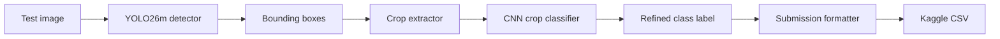

# Hybrid Architecture

## Goal

Combine YOLO detection with CNN classification so that each vehicle crop gets a final class prediction before CSV generation.

## Pipeline

## Component Roles

### YOLO26m detector

- Finds vehicles in the test image.
- Outputs box coordinates, class logits, and confidence scores.
- Best trained from `DUET/RoadVision_DUET/Modified_YOLO_Effective/data_train_all.yaml`.

### Crop extractor

- Uses each YOLO box to cut the vehicle region from the original image.
- Applies the same coordinate space as the detector output.
- Must clamp boxes to image bounds before cropping.

### CNN crop classifier

- Classifies the cropped vehicle image into one of the 13 RoadVision classes.
- Uses the dataset built under `DUET/RoadVision_DUET/CNN_Crop_Classifier/dataset/crops`.
- The saved model format is a Torch checkpoint containing `model`, `classes`, and `model_name`.

### Submission formatter

- Converts the final image-level predictions into Kaggle rows.
- Writes `image_id` using the bare file stem.
- Outputs `PredictionString` in the competition format.

## Current Repo State

- Detector training entrypoint exists at `DUET/YOLO11/train_yolo.py`.
- CNN training entrypoint exists at `DUET/RoadVision_DUET/CNN_Crop_Classifier/train_cnn.py`.
- A dedicated hybrid inference script is not created yet.

## Practical Recommendation

1. Train YOLO26m first with the modified split.
2. Train the CNN crop classifier next.
3. Add a hybrid inference script that loads both checkpoints and writes the submission CSV.
